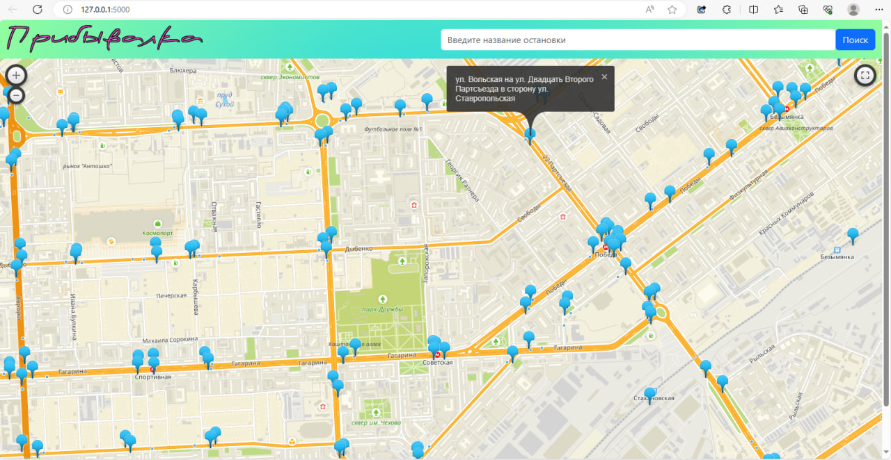

# Безопасность веб-приложений. Лабораторка №2

## Схема сдачи

## Вариант 2. Прогнозы транспорта

Осуществлена данная прибывалка с помощью:
    1. Bootstrap5(для мобильности)
    2. API 2ГИС(для отображения остановок на карте)
    3. Flask (для создания серверной части)
    4. xml.etree.ElementTree (для парсинга справочных странниц)

Загрузка приложения по адресу http://127.0.0.1:5000

Начальная страница содержит карту с указанными остановками, при нажатии на одну из них можно получить подробную информацию:

